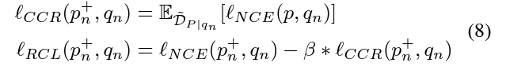

# passage-sieve

🌟 This is the official repo of the AAAI2024 paper Mitigating the Impact of False Negatives in Dense Retrieval with Contrastive Confidence Regularization. The formula of Contrastive Confidence Regularization(CCR) is as follows:




Here, $p$ stands for all the passages during the batch training (including positive and negative ones), $p^+$ for the positive passage, and $q$ for the query. Our proposed CCR can help the dense retrieval training robust to the false negative problem by helping the model to be more confident in its prediction and thus avoid overfitting to the noise information.


## NEWS

🔥 Trained model of MS-pas dataset with AR2+passage sieve algorithm has been released on [huggingface](https://huggingface.co/wangsky/AR2-sieved-MS). You can download and use it now!

🔥 Trained model of NQ dataset with AR2+passage sieve algorithm has been released on [huggingface](https://huggingface.co/wangsky/AR2-sieved-NQ). You can download and use it now!

Others are coming soon......

## Usage

This Branch only contains the necessary code for the passage sieve algorithm with confidence regularizer, which can be integrated into the training of any retrieval system. You can refer to the AR2 branch of this repo for an example implementation of combining passage sieve and AR2.

An example command to do so is :

```bash
for global_step in `seq 0 $Iteration_step $MAX_STEPS`;
#for global_step in 0
do

    python -u -m torch.distributed.launch --nproc_per_node=4 negative_train.py --lr 1e-7 --num_hard_negatives 5 --epoch 1 --mode pos --num_negatives_eval 30 --renew True\
     --model_path $DE_CKPT_PATH --path_to_dataset $OUT_DIR/temp/train_ce.json --log_dir ../tb_log/NQar2_n30_$global_step > ../log/NQar2_$global_step.txt

    #run your dense retrieval system training here using the sieved dataset: $OUT_DIR/temp/train_ce.json
    ......

    #Resampling the training dataset with new hard negatives, and save the dataset to $OUT_DIR/temp/train_ce.json
    ......
fi
```
$\beta$ in the CCR formulation is controlled by function f_beta in./sieve/loss.py; You might directly modify this function to control the $\beta$ during passage-sieve. We will consider adding this to the argument in the future.

## Directly leverage the contrastive confidence regularizer

This repo is for passage sieve and if you wish to leverage the contrastive confidence regularizer(CCR) directly you can refer to the code in our appendix and sieve/loss.py in this branch.

One implementation example is as follows:

```python
s = get_scores(q, p) #get the similarity matrix of one query q and all passages p
s_ = F.log_softmax(s, dim=1)#calculate softmax on passage dimension
loss = F.nll_loss(s_,positive_idx,reduction="none") #the original NCE loss
loss=loss-beta*(-1)*s_.mean(dim=1)#the only additional code to calculate CCR
loss=loss.mean()
```


During the usage of the CCR, there are several guidelines:

1. You should use cosine similarity priorly. In this case, we recommend you tune the beta from [0,1,0.2,0.3,...,1.0] if you have enough resources, otherwise, 0.5 should be a good choice. And we recommend you add the CCR after some normal training instead of directly using it from the beginning.
2. If you still wish to use Dot-Product similarity like in the original DPR paper, we recommend you choose a much smaller beta, e.g. 1e-4, 1e-3, and also consider adding this regular term only later in the training 
